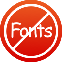

# Sans Fonts

## A WebKit Content Blocker That Kills Web Fonts With Fire

…except for icon fonts, because they don’t delay text rendering.

See [my blog post](https://jlnr.de/2015/09/13/sans-fonts.html) for the motivation behind this project.

## Download

You can [download the iOS 9 app here](https://itunes.apple.com/us/app/sans-fonts/id1037531461?mt=8).

If you are on OS X 10.11 (El Capitan) or later, you can download the code-signed Safari extensions on [the releases page](https://github.com/jlnr/SansFonts/releases).

## Limitations

* Content blockers cannot block fonts that are embedded in CSS files using `data:` URLs. (Yes, that is a thing.)
* Sans Fonts uses primitive heuristics to exclude Font Awesome and other icon fonts from being blocked — some non-icon fonts will probably slip through the cracks.
* The [blocker list](content-blocker/blockerList.json) is still very basic.
  I expect the list to grow as soon as I upgrade my work partition to El Capitan.

## Related Reading

This blog post was more helpful than the documentation on the Apple developer site: https://www.webkit.org/blog/3476/content-blockers-first-look/

## License

The media assets in here (PNG and Sketch files) are licensed under the Creative Commons BY-SA 4.0 license.
The author is: Julian Raschke, julian@raschke.de

All other files, including the source code and all build files, are released under the MIT license. Enjoy!
